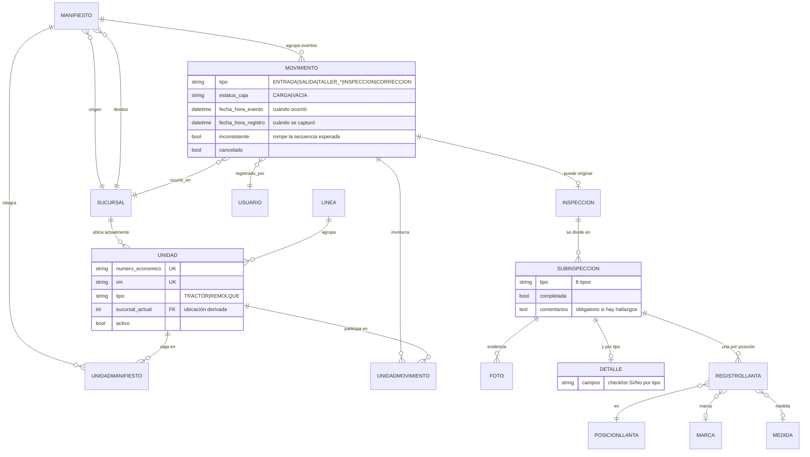
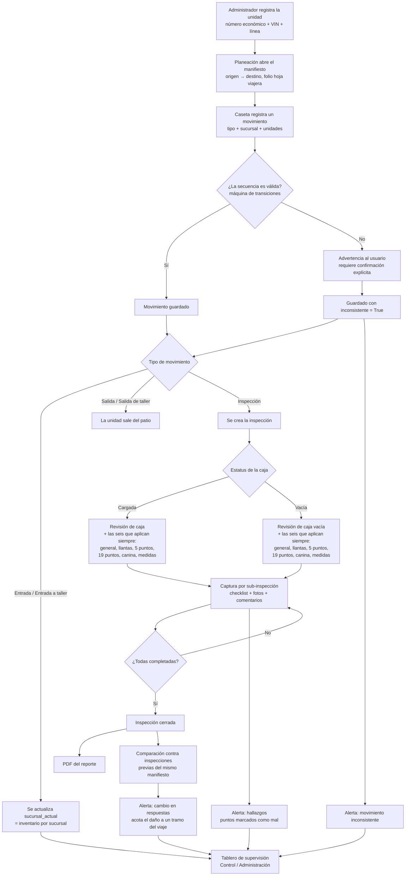

# Control de Unidades

Sistema web para el control de inventario, movimientos e inspecciones de unidades de
transporte (tractores y remolques) en una operación logística con varias sucursales.

## El problema

En una operación multisucursal, una unidad entra y sale de patios varias veces al día:
llega de un viaje, pasa a taller, sale con un manifiesto hacia otra sucursal, se inspecciona
antes de cruzar. El registro de esos eventos ocurre en caseta, muchas veces en libreta o en
una hoja de cálculo que cada sucursal mantiene por separado.

Dos consecuencias concretas:

**Nadie sabe con certeza dónde está una unidad.** La ubicación real solo existe en la memoria
del personal de cada patio. Contestar "¿cuántos remolques tengo en Guadalajara?" implica
llamar por teléfono. Cuando el registro de una salida nunca se anota, la unidad queda
fantasma en el inventario de la sucursal que la despachó.

**Las inspecciones en papel no dejan rastro comparable.** Los formatos de revisión —el
checklist de 19 puntos de seguridad, la revisión de caja, el conteo de llantas por posición—
se llenan a mano, se archivan y ahí mueren. El formato del viaje de ida y el del viaje de
regreso están en carpetas distintas, así que nadie nota que un punto que se marcó bien a la
salida aparece mal al regreso, ni que la llanta en la posición 3 ya no es la misma. Sin esa
comparación no hay forma de ubicar en qué tramo ni en qué turno ocurrió el daño, y sin eso no
hay a quién responsabilizar. El papel tampoco permite adjuntar evidencia fotográfica al punto
específico que se revisó.

Este sistema ataca las dos cosas: convierte cada evento de patio en un registro con
autor, fecha y sucursal, y convierte el formato de inspección en datos consultables y
comparables entre inspecciones de un mismo viaje.

## Cómo funciona

**Catálogos.** Un administrador registra las sucursales, las líneas transportistas (propias o
externas) y las unidades. Cada unidad tiene número económico y VIN, ambos únicos, y se
clasifica como tractor o remolque.

**Manifiesto.** Planeación abre el manifiesto del viaje: folio de hoja viajera, sucursal de
origen y destino, fecha de salida, número de fianza y las unidades que lo componen. El
manifiesto es el hilo que une todos los eventos de un mismo viaje.

**Movimientos.** En caseta se registra cada evento contra un manifiesto: entrada, salida,
entrada o salida de taller, o inspección. Un movimiento agrupa hasta un tractor y un
remolque, y guarda quién lo registró, cuándo ocurrió y en qué sucursal.

Antes de guardar, el sistema compara el tipo de evento contra el último movimiento de cada
unidad usando una máquina de transiciones válidas. Si la secuencia no cuadra —una salida sin
entrada previa, por ejemplo— muestra la advertencia y pide confirmación explícita; si el
usuario confirma, el movimiento se guarda marcado como inconsistente para que Control lo
revise después. En las entradas (a patio o a taller) se actualiza la ubicación de la unidad,
que es lo que sostiene el inventario por sucursal.

**Inspección.** Un movimiento de tipo inspección genera automáticamente la inspección y sus
sub-inspecciones aplicables. La aplicabilidad se declara como una condición por tipo: hoy la
única que discrimina es la de caja, que abre la revisión de caja cargada o la de caja vacía
según el estatus del movimiento. Las otras seis —general, llantas, 5 puntos, 19 puntos,
canina y medidas de remolque— se abren siempre.

Cada sub-inspección es un formulario propio que refleja su formato de papel: checklists de
Sí/No, el registro de llantas por posición con marca, medida y cautín, o las medidas del
remolque en metros. Se le adjuntan fotos, con un tope configurable por sub-inspección. Las
reglas de captura son las del formato original: para marcarla como completada no puede quedar
ningún punto sin responder, y si algún punto salió mal el comentario es obligatorio con un
mínimo de diez caracteres. La inspección completa solo se cierra cuando todas sus
sub-inspecciones están completadas.

**Reportes.** Cualquier inspección se descarga como PDF con el mismo formato de los
documentos que sustituye, fotos incluidas, para archivo o para entregarlo impreso.

**Supervisión y alertas.** Control y administración tienen un tablero que consulta las
inspecciones con filtros por fecha, sucursal, manifiesto y tipo de sub-inspección, con la
línea del tiempo de cada manifiesto. Sobre esos datos se derivan tres tipos de alerta:

- **Hallazgos**: la inspección tiene puntos marcados como mal.
- **Movimiento inconsistente**: la secuencia de eventos de la unidad no cuadra.
- **Cambio en respuestas**: un mismo punto de revisión cambió de respuesta entre dos
  inspecciones del mismo manifiesto. Esta es la que el papel no permitía: acota el daño al
  tramo del viaje entre ambas inspecciones, con la sucursal, la hora y el usuario que
  capturó cada una.

Las alertas se consultan en el tablero; el sistema todavía no las envía por ningún canal.

## Modelo de dominio



`DETALLE` representa ocho modelos concretos, uno por tipo de sub-inspección
(`DetalleGeneral`, `DetalleCaja`, `DetalleCajaVacia`, `DetalleCincoPuntos`,
`DetalleDiecinuevePuntos`, `DetalleCanina`, `DetalleMedidasRemolque`) más `RegistroLlanta`,
que es el único con varias filas por sub-inspección.

## Ciclo de vida de una unidad



## Decisiones técnicas

### La inspección cuelga del movimiento, no de la unidad

`Inspeccion` tiene una relación uno a uno con `Movimiento`. Una inspección no es un atributo
de la unidad sino un evento que ocurre en un lugar, a una hora y a cargo de alguien, y todo
eso ya lo describe el movimiento: sucursal, fecha del evento, fecha de captura, usuario y
manifiesto. Colgarla del movimiento evita duplicar ese contexto y hace que la inspección
herede automáticamente el hilo del viaje, que es lo que permite comparar la inspección de
salida contra la de regreso.

El costo es que reconstruir el historial de una unidad obliga a atravesar la tabla intermedia
`UnidadMovimiento` en lugar de leer una relación directa, y que un movimiento con tractor y
remolque produce una sola inspección para ambos: hoy el formato de papel se llena así, pero si
se necesitara separar hallazgos por unidad habría que romper esa relación.

### Un modelo por tipo de sub-inspección, en lugar de un catálogo genérico de puntos

Cada formato de inspección tiene su propio modelo con campos explícitos: `DetalleCaja` tiene
`bisagras`, `manivelas`, `reflejantes`; `DetalleDiecinuevePuntos` tiene sus diecinueve puntos
nombrados; `RegistroLlanta` tiene posición, marca, medida y cautín. La alternativa era un
esquema genérico —una tabla de puntos configurables y otra de respuestas— que habría permitido
agregar formatos desde el admin sin migraciones.

Se eligió el modelado explícito porque los ocho formatos son documentos estables y regulados,
no algo que el usuario deba poder inventar. A cambio se obtiene integridad de tipos en la base,
formularios y PDF que corresponden uno a uno con el papel, y consultas legibles por nombre de
campo en lugar de pivoteos sobre una tabla de pares clave-valor.

El costo se paga en volumen de código: ocho modelos, ocho formularios y ocho ramas de vista, y
una migración cada vez que cambia un punto de revisión. En el repositorio queda visible el
vestigio del enfoque descartado: el modelo `PlantillaPunto` existe y está registrado en el
admin, pero ninguna vista lo usa.

### Las inconsistencias advierten, no bloquean

`services.detectar_inconsistencia` compara el movimiento contra el último registrado para esa
unidad usando una tabla de transiciones válidas, y devuelve un mensaje en lugar de lanzar una
excepción. Si hay advertencias, la vista vuelve a renderizar el formulario con ellas y exige
un segundo envío con confirmación; el movimiento se guarda con `inconsistente = True`.

La razón es operativa: en caseta el registro ocurre después del hecho físico. La unidad ya
salió. Si el sistema bloqueara el registro por una secuencia rota —típicamente porque alguien
más omitió capturar el evento anterior— el resultado no sería un dato correcto, sería ningún
dato, y el hueco se propagaría a todo el historial de la unidad.

El trade-off es explícito: la base acepta secuencias imposibles a cambio de no perder eventos.
Lo que lo hace sostenible es que `inconsistente` no es solo un flag informativo, es la cola de
trabajo de Control: alimenta una categoría de alerta del tablero, así que cada confirmación
forzada queda visible para que alguien la corrija.

### La detección de alteraciones es derivada, no almacenada

La alerta de cambio en respuestas no vive en ninguna tabla. Se calcula en la petición:
se recorren las inspecciones de un manifiesto en orden cronológico y, por cada tipo de
sub-inspección, se compara campo por campo contra la última respuesta no vacía que se vio para
ese mismo campo. Cuando un punto pasa de Sí a No, eso es la alerta, y el par de inspecciones
involucradas acota el tramo del viaje donde ocurrió.

Calcularlo al vuelo evita mantener una tabla de hallazgos sincronizada con las capturas, que
es la clase de estado derivado que se desincroniza en cuanto alguien corrige un formulario.
Los campos de checklist se descubren por introspección del modelo, así que agregar un punto de
revisión no obliga a tocar el código de las alertas.

El límite es conocido y está en el código: el recorrido tiene un tope de registros por
consulta y la comparación se hace en memoria. Funciona con el volumen actual de un piloto y no
escala a un histórico grande; el siguiente paso natural es materializar el resultado al cerrar
la inspección. El otro costo es que la introspección identifica los campos de checklist por la
longitud del campo, que es una convención implícita: un `CharField` corto que no sea un
checklist entraría al conteo.

## Stack

| Componente    | Elección                                                      |
| ------------- | ------------------------------------------------------------- |
| Lenguaje      | Python 3.12                                                   |
| Framework     | Django 5.0 (vistas basadas en clases y en función, ORM)       |
| Base de datos | SQLite en desarrollo, PostgreSQL en producción (`psycopg`)    |
| Frontend      | Plantillas Django + CSS propio; Vue 3 desde CDN, sin build    |
| PDF           | WeasyPrint sobre una plantilla HTML                           |
| Imágenes      | Pillow, almacenamiento en disco vía `MEDIA_ROOT`              |
| Configuración | Variables de entorno con `python-dotenv`                      |

El tablero de supervisión consume endpoints JSON del propio Django con `fetch`. No hay
empaquetador ni paso de compilación de assets: el proyecto se sirve con `runserver` en
desarrollo y archivos estáticos de Django.

## Cómo correrlo localmente

Requisitos: Python 3.12 y las librerías de sistema que necesita WeasyPrint para generar PDF
(Pango, GLib y Cairo). En macOS con Homebrew:

```bash
brew install pango glib cairo
```

En Debian o Ubuntu el equivalente es `libpango-1.0-0 libpangoft2-1.0-0 libcairo2`. Sin ellas
el resto del sistema funciona, pero la descarga de PDF falla al importar WeasyPrint.

Instalación:

```bash
git clone https://github.com/miguelmurillo17/control-unidades.git
cd control-unidades
python3 -m venv venv
source venv/bin/activate
pip install -r requirements.txt
```

Configuración. Copia la plantilla de variables y ajústala:

```bash
cp .env.example .env
```

Las variables que lee `config/settings.py`:

| Variable               | Para qué sirve                                                        |
| ---------------------- | --------------------------------------------------------------------- |
| `DJANGO_SECRET_KEY`    | Clave de firma. Obligatoria cuando `DJANGO_DEBUG=False`.              |
| `DJANGO_DEBUG`         | `True` en desarrollo, `False` en producción.                          |
| `DJANGO_ALLOWED_HOSTS` | Dominios permitidos, separados por coma. Requerida si no hay debug.   |
| `DB_ENGINE`            | `sqlite3` por defecto; `postgresql` para Postgres.                    |
| `DB_NAME`              | Nombre de la base. Obligatoria si el motor no es SQLite.              |
| `DB_USER`              | Usuario de la base. Obligatoria si el motor no es SQLite.             |
| `DB_PASSWORD`          | Contraseña de la base. Obligatoria si el motor no es SQLite.          |
| `DB_HOST`, `DB_PORT`   | Host y puerto. Por defecto `localhost` y `5432`.                      |

Para desarrollo basta dejar `DJANGO_DEBUG=True` y `DB_ENGINE=sqlite3`: la clave de firma cae a
un valor de desarrollo declarado como inseguro y la base es un archivo SQLite local. Si
`DJANGO_DEBUG=False`, el arranque falla con un mensaje explícito mientras falte
`DJANGO_SECRET_KEY`. Para generar una:

```bash
python -c "from django.core.management.utils import get_random_secret_key; print(get_random_secret_key())"
```

Base de datos y arranque:

```bash
python manage.py migrate
python manage.py createsuperuser
python manage.py runserver
```

En macOS, si el PDF falla al importar WeasyPrint aunque Homebrew ya tenga las librerías,
arranca el servidor apuntando al directorio de bibliotecas:

```bash
DYLD_FALLBACK_LIBRARY_PATH=/opt/homebrew/lib python manage.py runserver
```

El sistema no incluye datos de ejemplo ni fixtures. Después de crear el superusuario hay que
dar de alta desde `/admin` o desde la interfaz, en este orden: sucursales, líneas y unidades, y
para poder capturar inspecciones de llantas, las posiciones, marcas y medidas. Los usuarios
operativos se crean con su rol, que determina lo que ve cada uno:

| Rol        | Qué puede hacer                                                            |
| ---------- | -------------------------------------------------------------------------- |
| Caseta     | Registra movimientos, captura inspecciones y las cierra                    |
| Planeación | Crea y edita manifiestos                                                   |
| Control    | Consulta todos los registros, el tablero de supervisión y las alertas      |
| Admin      | Todo lo anterior, más los catálogos y la gestión de usuarios               |

## Capturas

Guarda cada imagen en `docs/capturas/` con el nombre indicado y descomenta su línea.

**Registro de movimiento** — el formulario de caseta mostrando la advertencia de
inconsistencia y el botón de confirmación.
<!--  -->

**Sub-inspección en móvil** — un checklist Sí/No con comentarios y fotos, en el ancho de
pantalla en que se usa realmente.
<!--  -->

**Tablero de supervisión** — el listado de alertas y la línea del tiempo de un manifiesto.
<!--  -->

**Detalle de inspección** — el avance por sub-inspección y el cierre.
<!--  -->

**Reporte PDF** — una página del PDF generado.
<!--  -->

**Dashboard** — los totales de unidades, sucursales y movimientos del día.
<!--  -->

**Login** — la pantalla de entrada.
<!--  -->

## Estado del proyecto

Proyecto en desarrollo. El modelo de dominio se diseñó a partir del análisis de una operación
logística real: los ocho formatos de inspección, los tipos de movimiento y los roles
corresponden a procesos y documentos que hoy se llevan en papel.

Lo que está implementado y funcionando: catálogos, manifiestos, registro de movimientos con
detección de inconsistencias, inventario por sucursal, las ocho sub-inspecciones con
evidencia fotográfica, cierre de inspección, reporte en PDF y el tablero de supervisión con
sus tres categorías de alerta.

Limitaciones conocidas, en orden de lo que atacaría primero:

- **Sin pruebas automatizadas.** Los archivos `tests.py` están vacíos. La lógica que más las
  necesita es la máquina de transiciones de `services.py`, las reglas de validación de las
  sub-inspecciones y el cálculo de alertas.
- **Las alertas no notifican.** Se consultan en el tablero; no hay envío por correo ni por
  ningún otro canal, ni tarea programada que las evalúe.
- **El cálculo de alertas no escala.** Se hace en cada petición, en memoria y con topes de
  registros por consulta. Suficiente para un piloto, insuficiente para un histórico grande.
- **Inventario sin vista propia.** La ubicación de cada unidad se mantiene al día en
  `sucursal_actual` y el dashboard muestra totales, pero falta la consulta de existencias por
  sucursal con su desglose.
- **Condiciones de aplicabilidad a medias.** El mecanismo que decide qué sub-inspecciones
  abrir existe y está aislado en `services.py`, pero solo la revisión de caja discrimina por
  contexto; las demás se abren siempre, incluso cuando el formato de papel no lo exigiría.
- **Alerta de llantas pendiente.** Comparar las llantas inspeccionadas contra las registradas
  para la unidad requiere capturar antes los cambios de llanta autorizados en taller, que
  todavía no existe como flujo.
- **Despliegue no verificado contra PostgreSQL.** La configuración por variables de entorno
  está lista, pero las migraciones solo se han corrido contra SQLite.
- **`PlantillaPunto` es código muerto**, vestigio del enfoque genérico que se descartó.
